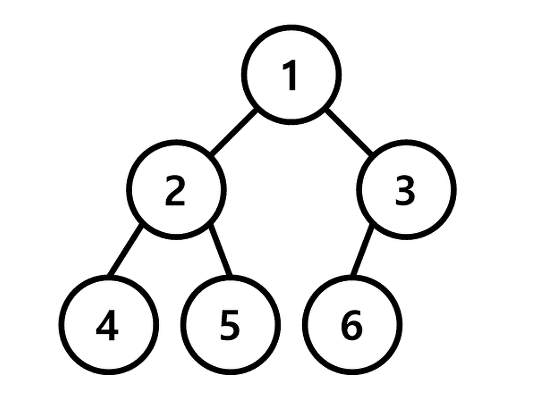

# 99클럽 코테 스터디 2일차 TIL

## 문제 링크
* 비기너 : https://school.programmers.co.kr/learn/courses/30/lessons/147355
* 미들러 : https://www.acmicpc.net/problem/11561
* 챌린저 : https://www.acmicpc.net/problem/1389


## 비기너 : String

* 문제 풀이 코드

    ```python
    def solution(t, p):
        answer = 0
        n = len(p)
        
        for i in range(len(t)-n+1) :
            number = int(t[i:i+n])
            if number <= int(p) :
                answer += 1
        
        return answer
    ```

* 문제를 풀기 위해 알아야 할 것
    1. string도 slicing이 가능하다.

        ```python
        string = 'Hello World!'
        print(string[:5]) # Hello
        ```
    2. type 변환 시켜주기

        ```python
        word = '111'
        print(type(word)) # str
        print(type(int(word))) # int
        ```


## 미들러 : binary search(이분 탐색)

* 문제 풀이 코드

    ```python
    import sys
    input = sys.stdin.readline

    tc = int(input())
    for _ in range(tc) :
        n = int(input())

        answer = 0

        bot = 0
        top = 10**16

        while bot <= top :
            mid = (bot + top) // 2

            if (mid * (mid+1))//2 < n :
                answer = mid
                bot = mid + 1
            elif (mid * (mid+1))//2 == n :
                answer = mid
                break
            else : # (mid * (mid+1))//2 > n
                top = mid - 1

        print(answer)
    ```

* 이분 탐색 문제인지 판별하는 꿀 TIP
    1. 최악의 상황을 가정해본다.
        * 이 문제의 경우 징검다리의 수 n의 범위가 `10**16`까지인데 1부터 탐색을 한다면 총 `10**16`번 탐색을 해야 한다.
    2. python은 초당 1억(`10**8`)회 정도의 단순 연산을 수행할 수 있다.
        * binary search의 시간복잡도는 `O(logn)`
        * 이 문제의 경우 `log(10**16) = 53.15`이므로 53초 정도 걸린다.
        * 이런 경우 `binary search를 사용해야 되지 않을까?`하고 의심할 수 있다.


## 챌린저 : BFS

* 문제 풀이 코드

    ```python
    import sys
    input = sys.stdin.readline
    from collections import deque

    n, m = map(int, input().rstrip().split())

    graph = [[] for _ in range(n+1)]

    for _ in range(m) :
        a, b = map(int, input().rstrip().split())
        graph[a].append(b)
        graph[b].append(a)

    # 케빈 베이컨의 수
    numbers = []

    def bfs(v) :
        q = deque([v])
        dist[v] = 0

        while q :
            target = q.popleft()

            # 친구 관계를 확인하고 탐색하지 않은 친구라면 탐색
            for i in graph[target] :
                if dist[i] == -1 :
                    # 케빈 베이컨(몇 다리를 건너야 하는지 표시)
                    dist[i] = dist[target] + 1
                    q.append(i)

    for i in range(1, n+1) :
        # 각 사람마다 bfs를 돌리기 위해 dist를 초기화
        dist = [-1] * (n+1)
        bfs(i)
        # 케빈 베이컨의 수를 numbers에 담는다.
        numbers.append(sum(dist))

    # python에서 index는 0부터 시작하므로 +1을 해줘야 한다.
    print(numbers.index(min(numbers))+1)
    ```


### BFS


* BFS = Breadth First Search 너비 우선 탐색 (가로 탐색)
* 비선형 구조인 그래프 구조는 그래프로 표현된 모든 자료를 빠짐없이 검색하는 것이 중요하다.

* 입력되는 graph의 차이는 노드의 방향이 있는지 없는지에 따라 바뀌게 된다.

    

    1. 노드의 방향이 없는 경우
        ```python
        graph = [[],
            [2, 3],
            [1, 4, 5],
            [1, 6],
            [2],
            [2],
            [3]
            ]
        ```
    2. 노드의 방향이 있는 경우 - ex.위에서 아래로 방향이 있는 경우
        ```python
        graph = [[],
            [2, 3],
            [4, 5],
            [6],
            [],
            [],
            []
            ]
        ```

* BFS의 특징
    * 그래프의 인접한 부분을 우선적으로 탐색하는 알고리즘(가로 탐색)
    * 인접 노드를 계속 큐에 넣어가며 큐에 들어온 순서대로 탐색을 시작하기에 시작 노드에서부터 가까운 노드들부터 탐색
* BFS 동작 과정
    1. 탐색 시작 노드를 큐에 삽입하고 방문 철
    2. 큐에서 노드를 꺼내 해당 노드를 방문하지 않은 모든 인접 노드를 모두 큐에 삽입하고 방문 처리
    3. 2번 과정을 더 이상 수행할 수 없을 때까지 반복

    * BFS 장점
        * 모든 경로를 탐색하기에 여러 해가 있을 경우에도 최단 경로임을 보장함
        * 최단 경로가 존재하면 깊이가 무한정 깊어진다고 해도 답을 찾을 수 있음
            * 여러 경로 중 무한한 길이를 가지는 경로가 존재하더라도, 모든 경로를 동시에 탐색을 진행하기 때문에 탐색 가능
        * 노드의 수가 적고, 깊이가 얕은 해가 존재할 때 유리함
            * 탐색하는 트리 또는 그래프의 크기에 비례하는 시간 복잡도를 가짐
    * BFS 단점
        * 노드의 수가 많을수록 탐색 가지가 급격히 증가함에 따라 보다 많은 메모리를 필요로 하게 된다.
            * 메모리 상의 확장된 노드들을 저장할 필요가 있기에 탐색하는 트리 또는 그래프에 크기에 비례하는 메모리를 가진다.

* BFS code - 탐색 순서 출력하기
    * index number와 node number의 혼동을 피하기 위해서 graph 및 방문을 했는지 확인하는 list(뒤에서 나오는 'visited')에서 실제 node의 수보다 1개 더 크게 만든다.

         

        ```python
        # BFS - queue
        from collections import deque

        n = int(input()) # n = 6

        visited = [False] * (n+1)
        ans = []

        def bfs(graph, start) :
            ans.append(start)
            queue = deque([start])
            visited[start] = True
            while queue :
                v = queue.popleft()
                for i in graph[v] :
                    if not visited[i] :
                        ans.append(i)
                        queue.append(i)
                        visited[i] = True

        bfs(graph, 1)
        print(*ans) # 1 2 3 4 5 6
        ```


```python
#99클럽 #코딩테스트준비 #개발자취업 #항해99 #TIL
```